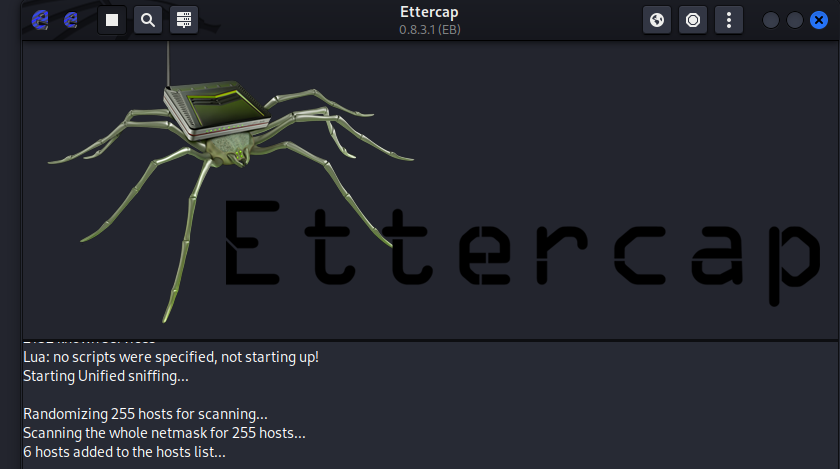

#  ARP Spoofing Detection Lab using Wireshark & Ettercap ( Documentation of this project ongoing)


This lab explores how an attacker can intercept network communication using ARP spoofing via Ettercap , and how this malicious activity can be detected and analyzed using Wireshark .” By simulating a MiTM attack in a controlled virtual lab, I was able to observe real packet-level manipulation and gain deeper insight into how ARP-based attacks compromise internal networks.

This hands-on exercise is part of my ongoing practical training toward becoming a **SOC Analyst**, helping me build essential skills in **network forensics**, **threat detection**, and **packet analysis**.

---

## Objectives

- Simulate a real-world ARP poisoning MiTM attack.
- Analyze ARP spoofing behavior using Wireshark.
- Observe how the attack affects victim systems (MAC table poisoning).
- Learn to detect signs like duplicated ping replies and IP conflicts.
- Practice command-line tools and filters relevant to threat hunting.

---

###  Virtual Setup

- **VirtualBox**
- **VM 1 (Attacker):** Kali Linux
- **VM 2 (Victim):** Ubuntu Desktop

### Network Configuration

- Network Adapter: **Bridged Adapter**
- **Promiscuous Mode:** Allow All (on each VM)
- **Cable Connected:** Enabled by default

## Initial ARP Table & Network Configuration (Before Spoofing)

Before executing the ARP spoofing attack, I verified the current ARP table and interface configuration on the victim machine (Ubuntu Desktop) using:

```
arp -a
```


From the `arp -a` output, we can see:

- The system recognizes the default gateway `192.168.7.150` as being associated with MAC address `46:e3:c8:27:3b:4d`, which is the **legitimate MAC** of the actual router.

This confirms that the ARP cache is clean — no spoofed or altered entries yet.

The `ifconfig` output also shows:

- The victim’s IP address is `192.168.7.49`
- The MAC address of this machine is `08:00:27:c8:bd:7d`
- Network interface `enp0s3` is active and functioning normally.

 **This clean state is crucial**, as it provides a point of comparison for identifying anomalies after the ARP spoofing begins. It validates that the ARP poisoning introduced later is responsible for any changes observed in the victim’s ARP table or communication flow.


### IP & MAC Table

| Device    | IP Address        | MAC Address             |
|-----------|-------------------|--------------------------|
| Gateway   | `192.168.7.150`   | `46:e3:c8:27:3b:4d`      |
| Kali (Attacker) | `192.168.7.200`   | `08:00:27:90:c4:45`      |
| Ubuntu (Victim) | `192.168.7.49`    | Auto-assigned (via DHCP) |

---

## Steps Performed

### 1.  Enabling IP Forwarding on the Attacker Machine
To successfully intercept and relay traffic between the victim (Ubuntu Machine) and the gateway, the attacker machine (Kali) must be configured to forward packets. This is done by enabling IP forwarding using the command:

```
sudo sysctl -w net.ipv4.ip_forward=1
```


As shown in the screenshot, the command was executed successfully, and the system confirms:
net.ipv4.ip_forward = 1

This setting is critical for completing the Man-in-the-Middle (MiTM) attack, as it allows Kali to act as a transparent bridge, intercepting and forwarding packets between both targets. Without this, the attack would break normal communication between the devices — making the MiTM obvious and ineffective.

## Launching Ettercap and Starting Host Discovery
Although Ettercap can be launched using the command line:

```
sudo ettercap -G
```

In this case, I used the search bar on Kali Linux to launch Ettercap’s GUI directly.



As shown in the screenshot, Ettercap has successfully started with its graphical interface. It begins unified sniffing and automatically scans the local subnet for active hosts. You can see from the output:
```
Scanning the whole netmask for 255 hosts...
6 hosts added to the hosts list...
```
This confirms that Ettercap is actively discovering devices on the network — an essential step before selecting targets for ARP spoofing. The graphical interface also confirms the tool version (0.8.3.1) and provides access to all the functions needed for target selection, MiTM execution, and real-time monitoring.

## Selecting Targets for ARP Spoofing in Ettercap

Once Ettercap is launched and begins host discovery, the next step is to define Target 1 (the victim) and Target 2 (the gateway). This sets up the parameters for the Man-in-the-Middle attack. interface eth0 was selected for this purpose. 


In this screenshot, Ettercap has populated the Host List after scanning the subnet. From the list:

192.168.7.49 was added as Target 1 (Ubuntu victim)

192.168.7.150 was added as Target 2 (Gateway/router)

These assignments are visible in the terminal-like log section at the bottom:
```
Host 192.168.7.49 added to TARGET1
Host 192.168.7.150 added to TARGET2
```

The MAC addresses next to the IPs confirm accurate mapping between IP and physical (hardware) addresses — important for ARP spoofing to work effectively.

Next Steps After Target Selection:

- Go to the MITM menu → select ARP poisoning.

- Check the box for "Sniff remote connections".

- Click Start Sniffing to launch the attack.

This setup allows Ettercap to begin manipulating ARP responses between the victim and gateway, redirecting traffic through the attacker machine.

## Start Packet Capture in Wireshark

Once Ettercap is actively spoofing ARP responses, we begin traffic monitoring in **Wireshark** to observe and analyze the attack in real-time.

1. Launch Wireshark on the Kali attacker VM.
2. Select the **bridged network interface** (eth0).
3. Apply the following **display filter** on wireshark to isolate ARP packets:

```
arp
```

Begin capturing traffic

## 4. Check ARP Table on Victim (Ubuntu)
```
arp -a
```


In the screenshot above, I am analyzing Frame 169 from the capture:

The source MAC is 08:00:27:90:c4:45 (Kali attacker).

The packet is an ARP reply falsely claiming:
192.168.7.150 is at 08:00:27:90:c4:45.

This packet is a spoofed ARP reply, where the attacker tells the victim (MAC: 08:00:27:c8:bd:7d) that the gateway IP (192.168.7.150) is associated with the attacker's MAC address.

Wireshark displays a warning at the bottom:

```
[Duplicate IP address detected for 192.168.7.150 (08:00:27:90:c4:45)]
```
This is a key indicator of an ARP spoofing attack. Wireshark has detected that two different MAC addresses are responding to the same IP address (192.168.7.150) — one is the real gateway, and the other is the attacker. This conflict confirms that the attack has successfully poisoned the ARP table of the victim.

Such duplicate IP detection is a powerful signal for threat hunters and SOC analysts when identifying MiTM activity on the network.


## After attack: Ubuntu sees attacker's MAC for Gateway IP:


### Note on Gateway IP Changes

In the initial lab setup, the gateway IP was `192.168.7.150`. However, after **restarting the lab environment a few days later**, the gateway IP had changed to `192.168.177.58`.

This behavior is expected in environments using **DHCP**, where IP addresses are dynamically assigned and may change after system reboots or lease expiration.

Despite the IP address change, the **MAC address of the gateway remained consistent**: `46:e3:c8:27:3b:4d`. This is a key reason why **ARP spoofing remains effective** — because devices trust MAC-to-IP mappings, and spoofing focuses on hijacking that trust at the MAC level.

As long as the MAC address of the target remains unchanged, the spoofing technique and its results stay valid. The only necessary adjustment is to reflect the updated IP address in the screenshots and analysis.


## Duplicate Ping Replies from Ubuntu


This indicates that both the gateway and Kali are forwarding packets , confirming that the attacker is in the communication path.

## MAC Table Poisoned
Ubuntu now believes that Kali's MAC belongs to the gateway. This proves that the attack was effective, and that the victim system is now exposed to interception.

# Conclusion 

This lab gave me the opportunity to execute and detect a full ARP spoofing attack using industry-relevant tools. Through live analysis in Wireshark and simulated traffic manipulation, I gained hands-on experience in identifying key signs of ARP-based MiTM threats.

This project supports my ongoing preparation for a SOC Analyst or Blue Team role by strengthening my capability to detect and respond to network-based threats in real-world environments.
